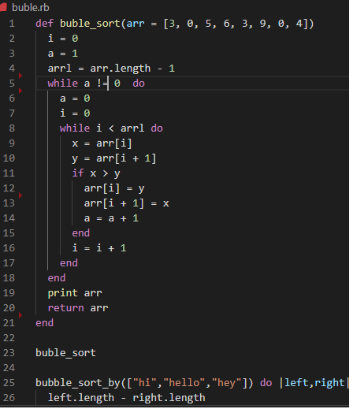

# BUBBLE SORT 

> This is an algorithm made with ruby, creating iterations and blocks.

This is a responsive site for all the screen sizes, that has a search bar in the header of the page, where you can look for your instruments by name and filter the results by different criteria. 

## Built With

- Ruby

## Live Demo

[Live Demo](https://raw.githack.com/Nexch/first-ruby-project/buble/buble.rb)

## Author

👤 **Jenny Cardenas**

- Github: [@janis-jenny](https://github.com/janis-jenny)
- Twitter: [@janis_jenny](https://twitter.com/janis_jenny)
- Linkedin: [linkedin](https://www.linkedin.com/in/paolajenny)

👤 **Mauricio Tavile**

- Github: [@janis-jenny](https://github.com/Nexch)
- Twitter: [@janis_jenny](https://twitter.com/MfinchT)
- Linkedin: [linkedin](https://www.linkedin.com/in/Nexch/)

## 🤝 Contributing

Contributions, issues and feature requests are welcome!

Feel free to check the [issues page](https://github.com/Nexch/first-ruby-project/issues).

## Show your support

Give a ⭐️ if you like this project!

## 📝 License

This project is [MIT](https://opensource.org/licenses/MIT) licensed.

